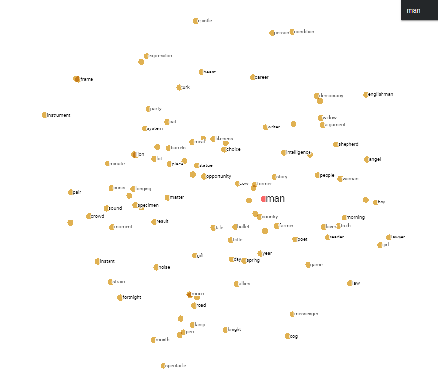
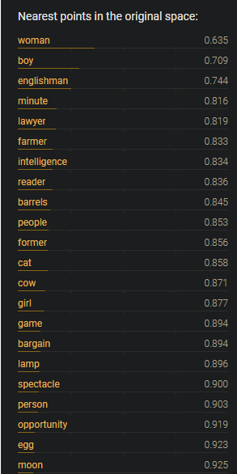

## Context2Vec example 

An application of the [context2vec: Learning Generic Context Embedding with Bidirectional LSTM](https://aclanthology.org/K16-1006) (Melamud et al., CoNLL 2016). It is a simple word-embedding learning technique. The contrasting aspect with word2vec is that it has a lstm for a more precise contextual representation using bidirectional LSTM with a multi-layer neural network at the top. 
Both word2vec and context2vec have the same loss function. 
The below picture shows the word embeddings in 2D space after computing the PCA of 50-dimensional vectors. The vectors were trained from 50 Gutenberg library books but the vocabulary was reduced to 5k only. 

